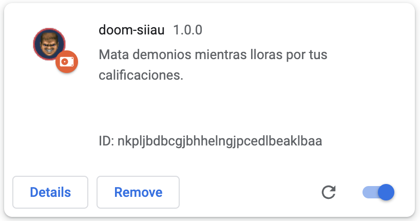

<div id="main" align="center">

![Lenguaje][language-shield]
![Version][version-shield]

[![Issues][issues-shield]][issues-url]
[![Forks][forks-shield]][forks-url]
[![Stargazers][stars-shield]][stars-url]

<br><br>

# doom-siiau
Mata demonios mientras lloras por tus calificaciones :feelsgood:

<br><br>

</div>

## ¿Por qué?

¿Alguna vez pensaste en jugar DOOM directamente en el SIIAU? Si lo hiciste probablemente deberías de buscar un psicólogo.
Pero bueno, si alguien ya corrió DOOM en el kiosko de rectoría en CUCEI, **por qué no hacer lo mismo directamente en el SIIAU** (?

**Atención:** Esta extensión sólo funciona en Chrome y derivados.

## Instalación

### Mediante la Chrome Web Store

*Próximamente...*

### Desde código fuente

[Descarga][zip-repositorio] el repositorio o clónalo mediante git a tu computadora con el siguiente comando.

```sh
git clone https://github.com/lordfriky/doom-siiau
```

Abre la página de extensiones de tu navegador poniendo `chrome://extensions` en una nueva pestaña o yendo al **menú de Chrome** (los 3 puntos en la esquina superior derecha) > **Más herramientas** > **Extensiones**.

Una vez dentro activa el `Modo Desarrollador` y haz clic en `Cargar Descomprimida`. En el explorador busca la carpeta `doom-siiau` dentro de este repositorio (**NO** la raíz de este). Finalmente debería aparecer un elemento como este.

<p align="center"></p>

## Uso

Para ejecutar DOOM sólo hace falta iniciar sesión en [SIIAU][url-siiau] y encontrarás la opción en el apartado **ALUMNOS** > **DOOM** (justo debajo de **Orden De Pago Cive**).

### Controles

<ul>
<li><strong>W A S D:</strong> Movimiento.</li>
<li><strong>Mouse:</strong> Vista.</li>
<li><strong>Clic izquierdo:</strong> Disparo</li>
<li><strong>1 2 3 4 5 6 7 8 9:</strong> Cambio de arma.</li>
</ul>

## Contribuir

¿Por qué alguien más debería perder el tiempo con esta cosa? Dedícate a estudiar papi.

## Changelog

- ### 1.0.1
**Fix:** Extensión no funcionando en SIIAU sobre HTTPS.

- ### 1.0.0
Primer release.

<br><p align="center" id="copyright-notice"><i>
Port de DOOM a JavaScript por <a href="https://dos.zone">DOS Zone</a>.<br>
DOOM es propiedad de id Software LLC.
</i></p>

<!--------------------->
<!--     Enlaces     -->
<!--------------------->

<!-- Badges estáticos -->
[language-shield]: https://img.shields.io/badge/LENGUAJE-HTML%2C%20JS-orange?style=for-the-badge
[version-shield]: https://img.shields.io/badge/VERSION-1.0.1-brightgreen?style=for-the-badge

<!-- Badges dinmámicos -->
[issues-shield]: https://img.shields.io/github/issues/lordfriky/doom-siiau.svg?style=for-the-badge
[issues-url]: https://github.com/lordfriky/doom-siiau/issues
[forks-shield]: https://img.shields.io/github/forks/lordfriky/doom-siiau.svg?style=for-the-badge
[forks-url]: https://github.com/lordfriky/doom-siiau/network/members
[stars-shield]: https://img.shields.io/github/stars/lordfriky/doom-siiau.svg?style=for-the-badge
[stars-url]: https://github.com/lordfriky/doom-siiau/stargazers

<!-- Enlaces varios -->
[zip-repositorio]: https://github.com/lordfriky/doom-siiau/archive/refs/heads/main.zip
[url-siiau]: http://siiauescolar.siiau.udg.mx/wus/gupprincipal.inicio
